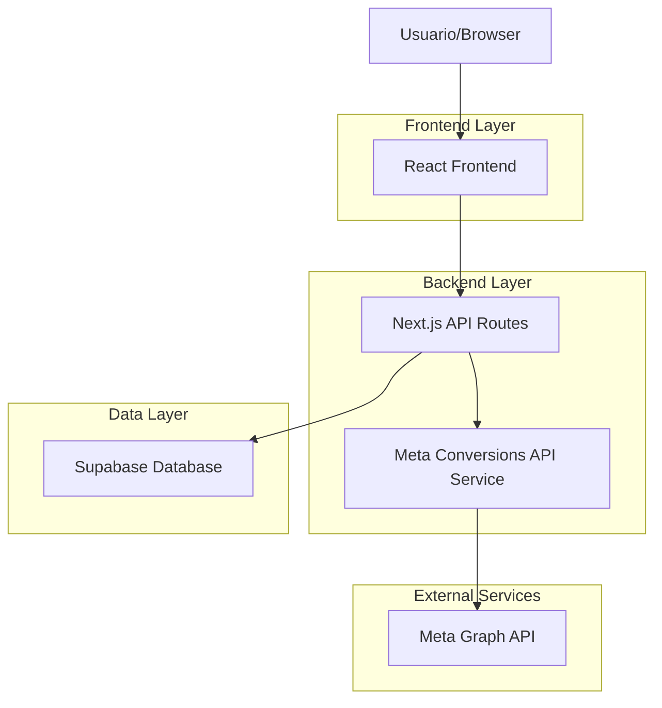
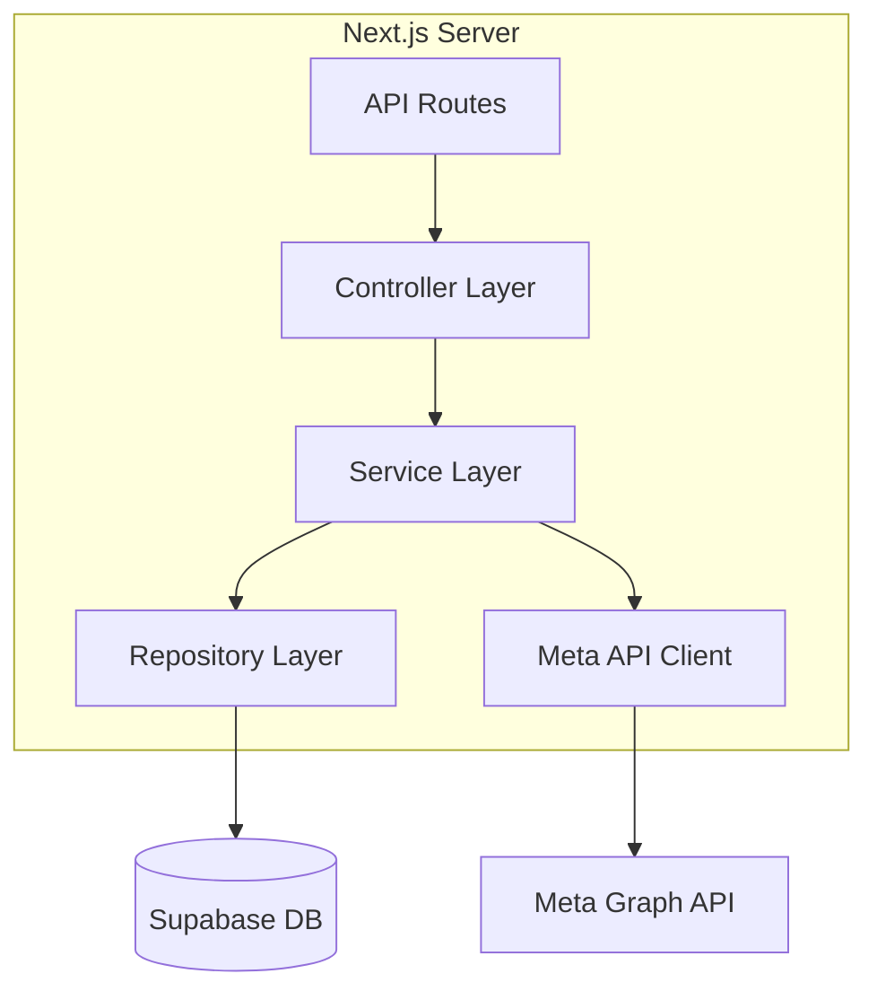
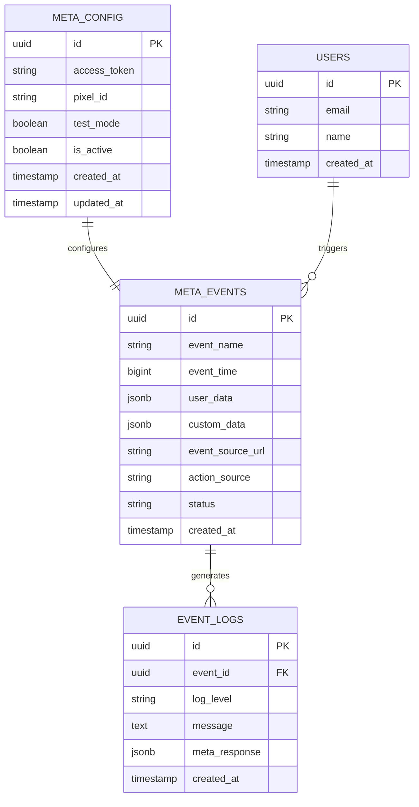

# Arquitectura Técnica - Meta Conversions API

## 1. Diseño de Arquitectura



## 2. Descripción de Tecnologías

* **Frontend**: React\@18 + Next.js\@14 + TailwindCSS\@3

* **Backend**: Next.js API Routes + Node.js

* **Base de datos**: Supabase (PostgreSQL)

* **APIs externas**: Meta Graph API v19.0+

* **Autenticación**: Supabase Auth + Meta Access Tokens

## 3. Definiciones de Rutas

| Ruta                           | Propósito                                      |
| ------------------------------ | ---------------------------------------------- |
| /admin/meta-conversions        | Panel de configuración de Meta Conversions API |
| /admin/meta-conversions/events | Dashboard de eventos y métricas                |
| /admin/meta-conversions/logs   | Logs de eventos y errores                      |
| /api/meta/events               | Endpoint para envío de eventos a Meta          |
| /api/meta/config               | Configuración y validación de tokens           |

## 4. Definiciones de API

### 4.1 API Principal

**Envío de eventos de conversión**

```
POST /api/meta/events
```

Request:

| Nombre del Parámetro | Tipo   | Requerido | Descripción                                             |
| -------------------- | ------ | --------- | ------------------------------------------------------- |
| event\_name          | string | true      | Tipo de evento (Purchase, ViewContent, AddToCart, etc.) |
| event\_time          | number | true      | Timestamp Unix del evento                               |
| user\_data           | object | true      | Datos del usuario (email, teléfono, IP, etc.)           |
| custom\_data         | object | false     | Datos personalizados (valor, moneda, productos)         |
| event\_source\_url   | string | false     | URL donde ocurrió el evento                             |
| action\_source       | string | true      | Fuente de la acción (website, app, etc.)                |

Response:

| Nombre del Parámetro | Tipo    | Descripción          |
| -------------------- | ------- | -------------------- |
| success              | boolean | Estado del envío     |
| event\_id            | string  | ID único del evento  |
| message              | string  | Mensaje de respuesta |

Ejemplo:

```json
{
  "event_name": "Purchase",
  "event_time": 1755739549,
  "user_data": {
    "em": ["hashed_email"],
    "ph": ["hashed_phone"],
    "client_ip_address": "192.168.1.1",
    "client_user_agent": "Mozilla/5.0..."
  },
  "custom_data": {
    "currency": "USD",
    "value": 99.99,
    "content_ids": ["product_123"]
  },
  "action_source": "website"
}
```

**Configuración de tokens**

```
POST /api/meta/config
```

Request:

| Nombre del Parámetro | Tipo    | Requerido | Descripción             |
| -------------------- | ------- | --------- | ----------------------- |
| access\_token        | string  | true      | Token de acceso de Meta |
| pixel\_id            | string  | true      | ID del pixel de Meta    |
| test\_mode           | boolean | false     | Modo de prueba          |

Response:

| Nombre del Parámetro | Tipo    | Descripción                 |
| -------------------- | ------- | --------------------------- |
| valid                | boolean | Validez de la configuración |
| message              | string  | Mensaje de validación       |

## 5. Arquitectura del Servidor



## 6. Modelo de Datos

### 6.1 Definición del Modelo de Datos



### 6.2 Lenguaje de Definición de Datos

**Tabla de Configuración de Meta (meta\_config)**

```sql
-- Crear tabla
CREATE TABLE meta_config (
    id UUID PRIMARY KEY DEFAULT gen_random_uuid(),
    access_token TEXT NOT NULL,
    pixel_id VARCHAR(50) NOT NULL,
    test_mode BOOLEAN DEFAULT false,
    is_active BOOLEAN DEFAULT true,
    created_at TIMESTAMP WITH TIME ZONE DEFAULT NOW(),
    updated_at TIMESTAMP WITH TIME ZONE DEFAULT NOW()
);

-- Crear índices
CREATE INDEX idx_meta_config_active ON meta_config(is_active);

-- Permisos Supabase
GRANT SELECT ON meta_config TO anon;
GRANT ALL PRIVILEGES ON meta_config TO authenticated;
```

**Tabla de Eventos de Meta (meta\_events)**

```sql
-- Crear tabla
CREATE TABLE meta_events (
    id UUID PRIMARY KEY DEFAULT gen_random_uuid(),
    event_name VARCHAR(50) NOT NULL,
    event_time BIGINT NOT NULL,
    user_data JSONB NOT NULL,
    custom_data JSONB,
    event_source_url TEXT,
    action_source VARCHAR(20) NOT NULL DEFAULT 'website',
    status VARCHAR(20) DEFAULT 'pending',
    created_at TIMESTAMP WITH TIME ZONE DEFAULT NOW()
);

-- Crear índices
CREATE INDEX idx_meta_events_name ON meta_events(event_name);
CREATE INDEX idx_meta_events_time ON meta_events(event_time DESC);
CREATE INDEX idx_meta_events_status ON meta_events(status);
CREATE INDEX idx_meta_events_created ON meta_events(created_at DESC);

-- Permisos Supabase
GRANT SELECT ON meta_events TO anon;
GRANT ALL PRIVILEGES ON meta_events TO authenticated;
```

**Tabla de Logs de Eventos (event\_logs)**

```sql
-- Crear tabla
CREATE TABLE event_logs (
    id UUID PRIMARY KEY DEFAULT gen_random_uuid(),
    event_id UUID REFERENCES meta_events(id) ON DELETE CASCADE,
    log_level VARCHAR(10) NOT NULL DEFAULT 'info',
    message TEXT NOT NULL,
    meta_response JSONB,
    created_at TIMESTAMP WITH TIME ZONE DEFAULT NOW()
);

-- Crear índices
CREATE INDEX idx_event_logs_event_id ON event_logs(event_id);
CREATE INDEX idx_event_logs_level ON event_logs(log_level);
CREATE INDEX idx_event_logs_created ON event_logs(created_at DESC);

-- Permisos Supabase
GRANT SELECT ON event_logs TO anon;
GRANT ALL PRIVILEGES ON event_logs TO authenticated;

-- Datos iniciales
INSERT INTO meta_config (access_token, pixel_id, test_mode) 
VALUES ('your_access_token_here', 'your_pixel_id_here', true);
```

## 7. Variables de Entorno

```env
# Meta Conversions API
META_ACCESS_TOKEN=your_access_token_here
META_PIXEL_ID=your_pixel_id_here
META_API_VERSION=v19.0
META_TEST_MODE=true

# Supabase (ya existentes)
NEXT_PUBLIC_SUPABASE_URL=your_supabase_url
NEXT_PUBLIC_SUPABASE_ANON_KEY=your_supabase_anon_key
SUPABASE_SERVICE_ROLE_KEY=your_service_role_key
```

## 8. Consideraciones de Seguridad

* **Tokens de acceso**: Almacenar de forma segura en variables de entorno

* **Hashing de datos**: Hash automático de emails y teléfonos antes del envío

* **Validación de entrada**: Validar todos los datos antes del envío a Meta

* **Rate limiting**: Implementar límites de velocidad para evitar spam

* **Logs de auditoría**: Registrar todos los eventos para auditoría

* **Encriptación**: Usar HTTPS para todas las comunicaciones

* **Permisos**: Acceso restringido solo a usuarios autenticados

