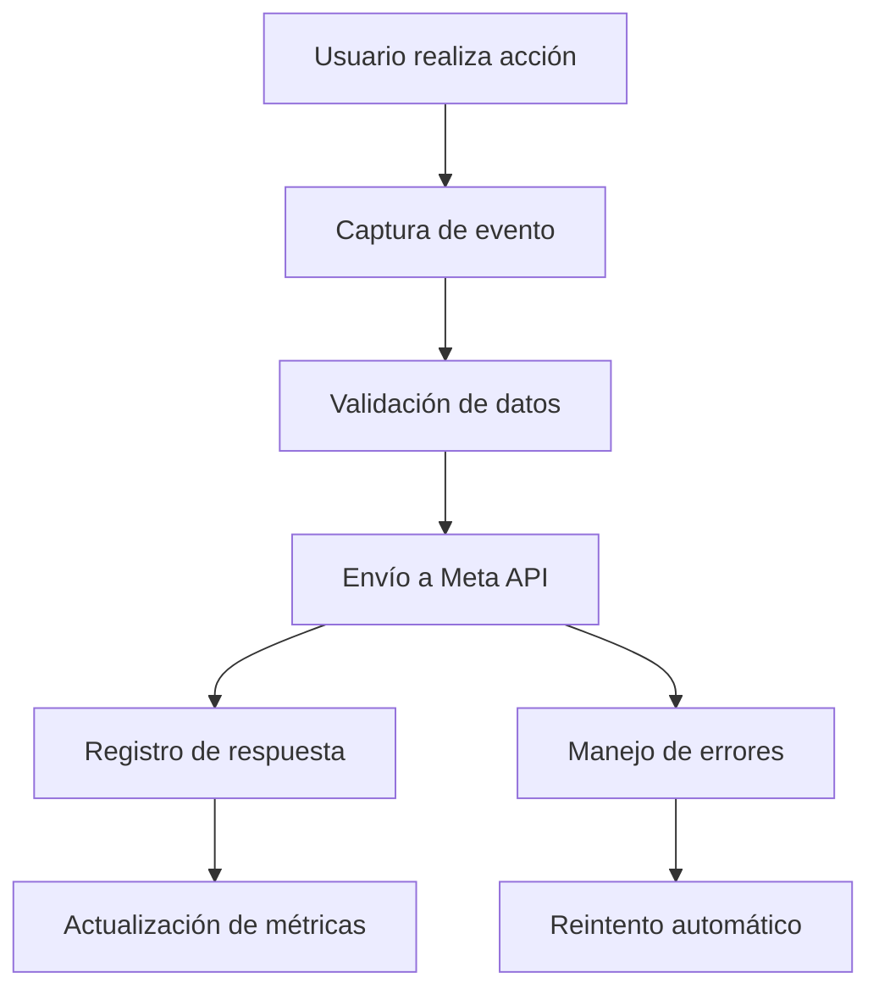

# Integración de Meta Conversions API

## 1. Descripción General del Proyecto

Este documento describe la implementación de Meta Conversions API en el proyecto de e-commerce para mejorar el seguimiento de conversiones y optimizar las campañas publicitarias de Facebook/Meta. La API permite enviar eventos de conversión desde el servidor, proporcionando datos más precisos y confiables que el pixel tradicional.

## 2. Características Principales

### 2.1 Roles de Usuario

| Rol | Método de Registro | Permisos Principales |
|-----|-------------------|---------------------|
| Administrador | Acceso directo al panel | Configurar tokens de acceso, ver métricas de conversión |
| Sistema | Automático | Enviar eventos de conversión a Meta |

### 2.2 Módulos de Funcionalidad

Nuestra integración de Meta Conversions API consta de las siguientes páginas principales:

1. **Panel de Configuración**: configuración de tokens, validación de conexión, métricas de eventos.
2. **API de Eventos**: endpoints para envío de eventos, validación de datos, manejo de errores.
3. **Monitoreo**: dashboard de eventos enviados, logs de errores, estadísticas de conversión.

### 2.3 Detalles de Páginas

| Nombre de Página | Nombre del Módulo | Descripción de Funcionalidad |
|------------------|-------------------|------------------------------|
| Panel de Configuración | Configuración de API | Configurar access token, pixel ID, validar conexión con Meta |
| Panel de Configuración | Métricas de Eventos | Mostrar estadísticas de eventos enviados, tasa de éxito |
| API de Eventos | Endpoint de Purchase | Enviar eventos de compra con datos del producto y usuario |
| API de Eventos | Endpoint de ViewContent | Enviar eventos de visualización de contenido |
| API de Eventos | Endpoint de AddToCart | Enviar eventos de agregar al carrito |
| API de Eventos | Endpoint de InitiateCheckout | Enviar eventos de inicio de checkout |
| Monitoreo | Dashboard de Eventos | Visualizar eventos enviados en tiempo real |
| Monitoreo | Logs de Errores | Mostrar errores de envío y su resolución |

## 3. Proceso Principal

### Flujo de Eventos de Conversión

1. **Usuario realiza acción** (compra, visualización, etc.)
2. **Sistema captura evento** con datos relevantes
3. **Validación de datos** antes del envío
4. **Envío a Meta Conversions API** con autenticación
5. **Registro de respuesta** y manejo de errores
6. **Actualización de métricas** en el dashboard

## 4. Diseño de Interfaz de Usuario

### 4.1 Estilo de Diseño

- **Colores primarios**: #1877F2 (azul Meta), #42B883 (verde éxito)
- **Colores secundarios**: #E4E6EA (gris claro), #F02849 (rojo error)
- **Estilo de botones**: Redondeados con sombra sutil
- **Fuente**: Inter, tamaños 14px-24px
- **Estilo de layout**: Basado en tarjetas con navegación lateral
- **Iconos**: Lucide React para consistencia

### 4.2 Resumen de Diseño de Páginas

| Nombre de Página | Nombre del Módulo | Elementos de UI |
|------------------|-------------------|----------------|
| Panel de Configuración | Configuración de API | Formulario con campos de token y pixel ID, botón de validación, indicadores de estado |
| Panel de Configuración | Métricas de Eventos | Gráficos de barras y líneas, tarjetas de estadísticas, tabla de eventos recientes |
| Monitoreo | Dashboard de Eventos | Lista en tiempo real, filtros por tipo de evento, indicadores de estado |
| Monitoreo | Logs de Errores | Tabla paginada, filtros por fecha, detalles expandibles de errores |

### 4.3 Responsividad

La aplicación está diseñada mobile-first con adaptación completa para escritorio. Incluye optimización táctil para dispositivos móviles y navegación simplificada en pantallas pequeñas.