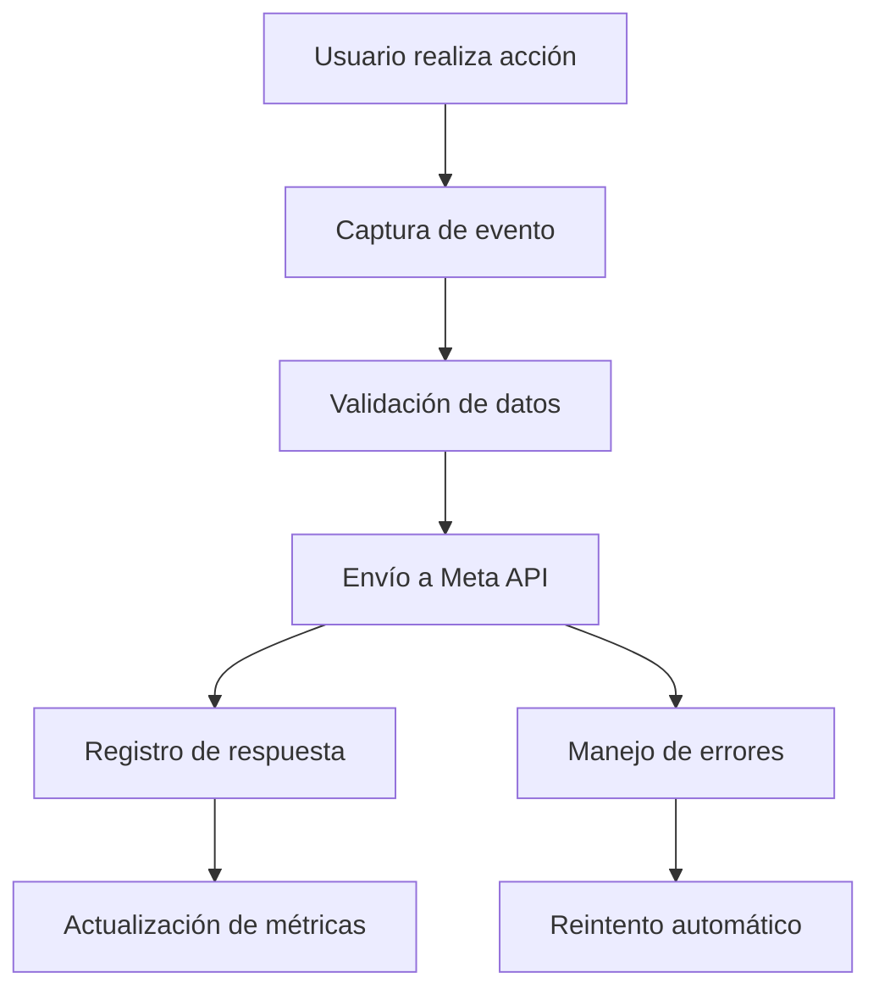

# Integración de Meta Conversions API

## 1. Descripción General del Proyecto

Este documento describe la implementación completa de Meta Conversions API en el proyecto de e-commerce para maximizar el seguimiento de conversiones y optimizar las campañas publicitarias de Facebook/Meta. La API permite enviar eventos de conversión desde el servidor con parámetros de alta calidad que mejoran significativamente la precisión de las coincidencias de eventos.

### Parámetros de Calidad Implementados

Según Meta, la implementación de parámetros de calidad específicos aumenta las conversiones registradas:

- **Facebook Click ID (fbc)**: +54.7% conversiones adicionales registradas
- **Email hasheado (SHA-256)**: +42.4% conversiones adicionales registradas  
- **Teléfono hasheado (SHA-256)**: +11.56% conversiones adicionales registradas
- **Facebook Browser ID (fbp)**: +5.83% conversiones adicionales registradas
- **External ID**: +5.83% conversiones adicionales registradas
- **Dirección IP del cliente**: Mejora la precisión de geolocalización y coincidencias

## 2. Características Principales

### 2.1 Roles de Usuario

| Rol | Método de Registro | Permisos Principales |
|-----|-------------------|---------------------|
| Administrador | Acceso directo al panel | Configurar tokens de acceso, ver métricas de conversión |
| Sistema | Automático | Enviar eventos de conversión a Meta |

### 2.2 Módulos de Funcionalidad

Nuestra integración de Meta Conversions API consta de las siguientes páginas principales:

1. **Panel de Configuración**: configuración de tokens, validación de conexión, métricas de eventos.
2. **API de Eventos**: endpoints para envío de eventos, validación de datos, manejo de errores.
3. **Monitoreo**: dashboard de eventos enviados, logs de errores, estadísticas de conversión.

### 2.3 Detalles de Páginas

| Nombre de Página | Nombre del Módulo | Descripción de Funcionalidad |
|------------------|-------------------|------------------------------|
| Panel de Configuración | Configuración de API | Configurar access token, pixel ID, validar conexión con Meta |
| Panel de Configuración | Métricas de Eventos | Mostrar estadísticas de eventos enviados, tasa de éxito, calidad de coincidencias |
| API de Eventos | Endpoint de AddToCart | Enviar eventos de agregar al carrito con parámetros de calidad (fbc, fbp, email, teléfono, external_id) |
| API de Eventos | Endpoint de ViewContent | Enviar eventos de visualización de contenido con datos de usuario hasheados |
| API de Eventos | Endpoint de InitiateCheckout | Enviar eventos de inicio de checkout con máxima calidad de datos |
| Utilidades de Hashing | Funciones de SHA-256 | Hashear email y teléfono según especificaciones de Meta |
| Tracking de Facebook | Captura de FBC/FBP | Capturar automáticamente fbclid de URL y convertir a fbc |
| Monitoreo | Dashboard de Eventos | Visualizar eventos enviados con métricas de calidad de coincidencias |
| Monitoreo | Logs de Errores | Mostrar errores de envío y su resolución con detalles de parámetros |

## 3. Proceso Principal

### Flujo de Eventos de Conversión

1. **Usuario realiza acción** (compra, visualización, etc.)
2. **Sistema captura evento** con datos relevantes
3. **Validación de datos** antes del envío
4. **Envío a Meta Conversions API** con autenticación
5. **Registro de respuesta** y manejo de errores
6. **Actualización de métricas** en el dashboard

## 4. Diseño de Interfaz de Usuario

### 4.1 Estilo de Diseño

- **Colores primarios**: #1877F2 (azul Meta), #42B883 (verde éxito)
- **Colores secundarios**: #E4E6EA (gris claro), #F02849 (rojo error)
- **Estilo de botones**: Redondeados con sombra sutil
- **Fuente**: Inter, tamaños 14px-24px
- **Estilo de layout**: Basado en tarjetas con navegación lateral
- **Iconos**: Lucide React para consistencia

### 4.2 Resumen de Diseño de Páginas

| Nombre de Página | Nombre del Módulo | Elementos de UI |
|------------------|-------------------|----------------|
| Panel de Configuración | Configuración de API | Formulario con campos de token y pixel ID, botón de validación, indicadores de estado |
| Panel de Configuración | Métricas de Eventos | Gráficos de barras y líneas, tarjetas de estadísticas, tabla de eventos recientes |
| Monitoreo | Dashboard de Eventos | Lista en tiempo real, filtros por tipo de evento, indicadores de estado |
| Monitoreo | Logs de Errores | Tabla paginada, filtros por fecha, detalles expandibles de errores |

### 4.3 Responsividad

La aplicación está diseñada mobile-first con adaptación completa para escritorio. Incluye optimización táctil para dispositivos móviles y navegación simplificada en pantallas pequeñas.

## 5. Implementación Técnica de Parámetros de Calidad

### 5.1 Funciones de Hashing (src/utils/hashing.ts)

#### Email Hashing
- **Normalización**: Conversión a minúsculas y eliminación de espacios
- **Validación**: Verificación de formato de email válido
- **Hashing**: SHA-256 según especificaciones de Meta
- **Impacto**: +42.4% conversiones adicionales registradas

#### Teléfono Hashing
- **Normalización**: Eliminación de caracteres no numéricos, adición de código de país
- **Validación**: Verificación de longitud mínima (10 dígitos)
- **Hashing**: SHA-256 con formato internacional
- **Impacto**: +11.56% conversiones adicionales registradas

#### External ID Generation
- **Priorización**: user_id > session_id > IP-based ID
- **Formato**: Prefijos descriptivos (user_, session_, ip_)
- **Validación**: Caracteres alfanuméricos, máximo 64 caracteres
- **Impacto**: +5.83% conversiones adicionales registradas

### 5.2 Captura de IP Mejorada

#### Headers Soportados (en orden de prioridad)
1. `cf-connecting-ip` (Cloudflare)
2. `x-forwarded-for` (Proxy/Load balancer)
3. `x-real-ip` (Nginx)
4. `x-client-ip` (Apache)
5. `x-forwarded`, `forwarded-for`, `forwarded` (Otros proxies)

#### Validación de IP
- **IPv4**: Validación con regex específica
- **IPv6**: Soporte básico para formato estándar
- **Múltiples IPs**: Extracción de la primera IP (cliente original)

### 5.3 Tracking de Facebook (src/utils/facebook-tracking.ts)

#### Facebook Click ID (fbc)
- **Captura**: Automática desde parámetro `fbclid` en URL
- **Conversión**: Formato `fb.1.timestamp.fbclid_value`
- **Almacenamiento**: Cookie `_fbc` con expiración de 90 días
- **Impacto**: +54.7% conversiones adicionales registradas

#### Facebook Browser ID (fbp)
- **Generación**: Automática si no existe
- **Formato**: `fb.1.timestamp.random_number`
- **Almacenamiento**: Cookie `_fbp` con expiración de 90 días
- **Impacto**: +5.83% conversiones adicionales registradas

### 5.4 Integración en APIs de Conversión

Todas las rutas API (`/api/conversions/*`) implementan:

1. **Recepción de parámetros**: email, phone, externalId desde el frontend
2. **Hashing automático**: Aplicación de SHA-256 a email y teléfono
3. **Priorización de datos**: Frontend > cookies para fbc/fbp
4. **Generación de external_id**: Automática si no se proporciona
5. **Captura de IP**: Múltiples headers como fallback
6. **Envío a Meta**: Todos los parámetros de calidad incluidos

### 5.5 Beneficios de la Implementación

#### Mejora en Coincidencias de Eventos
- **Total estimado**: Hasta +118.53% conversiones adicionales registradas
- **Redundancia**: Múltiples parámetros de identificación
- **Precisión**: Datos normalizados y hasheados correctamente
- **Automatización**: Captura automática sin intervención manual

#### Calidad de Datos
- **Consistencia**: Normalización estándar según Meta
- **Seguridad**: Hashing SHA-256 para datos sensibles
- **Validación**: Verificación de formato antes del envío
- **Fallbacks**: Múltiples fuentes para cada parámetro